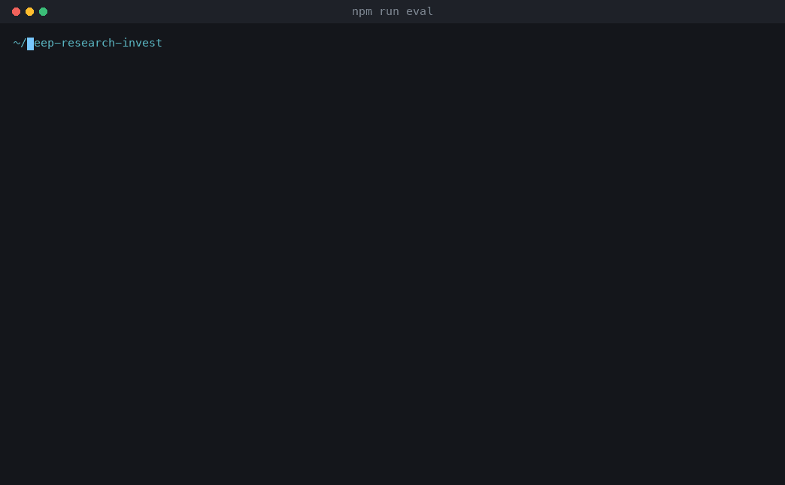

# Thesis — Deep Research for Investors

Ask an investing question, get a cited equity research thesis rendered as a clean research note.

**Live:** https://deep-research-invest.vercel.app (public — no login required)

**[Build writeup](./writeup.md)** — what the system does, and the optimization made at
each stage with the measurement behind it.

## Demo

A live run against production — question in, progress through the three stages, then the
rendered note with its cited footnotes:


The same pipeline seen from Langfuse: one trace per run, the two Groq generations with
their prompts and token usage, and every search as its own span.


> Deployment Protection is off so the link can be shared freely. Each run spends
> roughly 12 Tavily credits against a 1,000/month free tier — about 80 runs — so the
> URL is a metered resource. Two things blunt that: identical questions are served
> from an in-process cache without touching either API, and the run itself is capped
> at 6 searches.
>
> Rotate `TAVILY_API_KEY` and `GROQ_API_KEY` once the demo window closes. To gate it
> again: Project Settings → Deployment Protection → All Deployments, or generate a
> Protection Bypass secret to keep it shareable without granting team access.

## How it works

```
question
  → cache lookup         repeat question → served instantly, no API calls
  → Groq gpt-oss-20b     identify company/ticker + 4-6 research angles
  → Tavily × N angles    concurrent search (Promise.allSettled), time-boxed to 1 year
                         12s per-angle timeout, 1 retry on 429/5xx, survives partial failure
  → dedupe + number      top 18 sources, snippets trimmed to 350 chars
  → Groq gpt-oss-120b    ONE synthesis call → structured thesis JSON
  → React/CSS            deterministic render, no further LLM calls
  → Langfuse             the finished transcript is replayed as a trace
```

A typical run costs ~5,800 tokens and takes 9-17 seconds.

Token efficiency is architectural: only one LLM call produces content. The report's
formatting comes from rendering structured JSON, not from asking a model to write prose.
Source snippets are capped and deduped before they reach the synthesis prompt, and the
schema itself bounds output length (bullet counts, word limits).

## Setup

1. Get free API keys (no credit card required for either):
   - Tavily — https://tavily.com (1,000 credits/month free)
   - Groq — https://console.groq.com (free tier)
2. `cp .env.example .env.local` and fill in both keys.
3. `npm install && npm run dev` → http://localhost:3000

Set `MOCK_RESEARCH=1` to run the UI against a fixture instead of live APIs (useful for
demoing the layout without spending credits).

## Transcripts

Every local run writes a full transcript to `transcripts/<timestamp>_<slug>.json`:
both Groq prompts and raw responses, every Tavily query and result, per-call token
usage and timings, and the final validated thesis.

Known limitation: transcript writing is disabled on Vercel (`process.env.VERCEL`),
because the serverless filesystem is ephemeral. Transcript review happens against
local `npm run dev` runs.

## Evals

```bash
npm run eval          # score every committed transcript — no API calls, ~1s
npm run eval:judge    # ...and grade each one with an LLM judge
npm run eval:live     # run the golden question set for real, then score it
```

Eighteen deterministic scorers and three model-graded ones, run over the transcripts
above. Because the transcript already holds both prompts, both raw responses and every
search result, scoring needs no keys and no re-run — the artifact the pipeline writes
for observability doubles as the eval fixture.

The scorers check properties the pipeline actually promises: that no angle query carries
a literal date, that price hits come back dated, that every claim cites a source that
exists, that every figure in a cited claim appears in one of the sources it cites, that
the price quote names one venue in one currency. `npm run eval` exits non-zero when any
scorer falls below its threshold, so it can gate a prompt change or a model swap.

Grounding is scored against the truncated snippets the model was actually shown, parsed
back out of the synthesis prompt — not the full Tavily payload, and not the live web.



### An example

Scoring the most recent run — the one made after every fix in this repo landed — with the
judge enabled:

```console
$ npm run eval -- --since 2026-09-14T17:00 --judge

scorer                             n   score    min                status
plan/no-literal-dates              1   1.000   1.00  ██████████    pass
plan/price-angle-present           1   1.000   1.00  ██████████    pass
retrieval/price-source-dated       1   1.000   0.80  ██████████    pass
retrieval/source-dedup             1   1.000   1.00  ██████████    pass
thesis/citation-coverage           1   1.000   1.00  ██████████    pass
thesis/price-dated                 1   1.000   0.90  ██████████    pass
thesis/number-provenance           1   0.857   0.85  █████████░    pass
thesis/source-utilisation          1   0.556   0.50  ██████░░░░    pass
judge/groundedness                 1   0.867   0.85  █████████░    pass
judge/comparison-direction         1   0.750   0.90  ████████░░    FAIL
judge/answers-question             1   1.000   0.90  ██████████    pass
                                              (11 of 21 scorers shown)

DETAIL                                        (trimmed — full output in the GIF above)

· thesis/number-provenance
    - catalysts[2]: "1200" not in sources [17] — "Price target of $1,200 suggests ~33% upside"

· judge/groundedness
    - catalysts[2] — unsupported: Snippet shows $1,011.88 target, not $1,200 or 33% upside

✗ judge/comparison-direction
    - catalysts[2] — incorrect: $1,200 target vs $902.38 price

1 scorer(s) below threshold.
```

One fabricated price target, caught three times from three directions: a counter that
found a figure in no cited source, a reader that found the source saying $1,011.88, and a
comparison check that found the two numbers incompatible. The `$1,200` exists only in that
source's **headline** — its body gives $1,011.88 and 12.13% upside.

`thesis/source-utilisation` at 0.556 is the other live finding: half the top 18 sources are
never cited, which is the pure-relevance sort surfacing the wrong pages.

See **[evals/README.md](./evals/README.md)** for the full scorer table, the thresholds and
how to read a run.

## Tracing (optional)

Set `LANGFUSE_PUBLIC_KEY` and `LANGFUSE_SECRET_KEY` to send each run to
[Langfuse](https://langfuse.com) as a trace — both prompts and responses, token usage,
and every search as its own span, with failed angles at ERROR level. This is what covers
**production** runs, where the JSON transcript cannot be written.

The trace is built by replaying the finished transcript, so the pipeline itself has no
vendor import, and a Langfuse outage cannot slow down or break research. Without the keys
tracing no-ops entirely; `LANGFUSE_TRACING=0` disables it even when keys are set.

Trace ids match the local transcript `runId`, so a trace and a `transcripts/*.json` file
can be lined up one-to-one.

## Deploy (Vercel free tier)

1. Push to a Git remote, import the repo at vercel.com, or run `npx vercel`.
2. Set `TAVILY_API_KEY` and `GROQ_API_KEY` in Project Settings → Environment Variables.
3. Confirm Fluid Compute is enabled (Project Settings → Functions). Without it, Hobby
   caps functions at 60s and a slow research run will 504; with it, the limit is 300s,
   which `app/api/research/route.ts` requests via `export const maxDuration = 300`.
